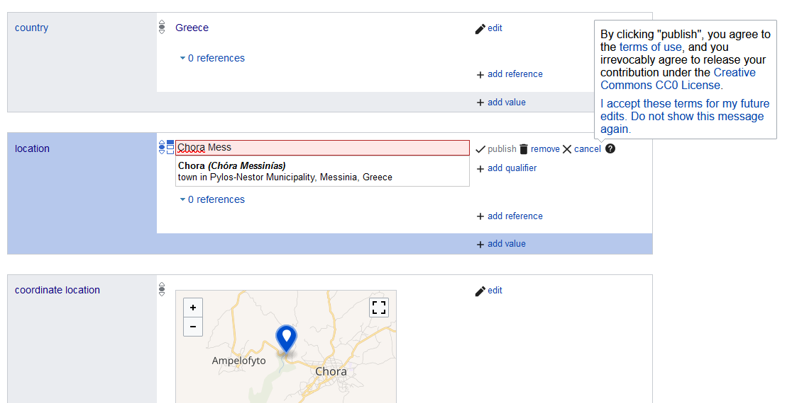

# récupérer dans wikidata tous les éléments correspondant à des batailles


## principes du SPARQL

batailles livrées en Grêce entre 1940 et 1949 au cours de trois conflits différents : 
- guerre italo-grecque
- résistance grecque à l'occupation allemande
- guerre civile

Si on ne s'occupe que de la Résistance : 
L'élément "résistance à l'occupation allemande" est le [Q490035](https://www.wikidata.org/wiki/Q490035)

Structuration des données dans Wikidata : 

| élément | propriété | valeur |
|:---|:---|:---|
| la terre | a pour satellite | la lune |
| Q2 | P398 | Q405 |


| élément | propriété | valeur |
|:---|:---|:---|
| Marignan (la ville) | est une instance de (=est) | une commune d'Italie |
| Q42932) | P31 | Q747074 |

| élément | propriété | valeur |
|:---|:---|:---|
| Marignan (la bataille) | est une instance de (=est) | une bataille |
| Q330) | P31 | Q178561 |


Q = éléments, P = propriétés ; les éléments sont aussi des valeurs dans le triplet élément, propriété, valeur

on peut interroger n'importe quel triplet, ajouter des conditions. 

Le [service de requête](https://query.wikidata.org/) de Wikidata est ouvert à tout le monde. Il dispose d'un grand nombre d'exemples dont on peut s'inspirer pour apprendre à utiliser le langage de requête utilisé par Wikidata comme par d'autres sites du même ordre : le sparql. 


Possible d'interroger (et d'enrichir) également Wikidata à travers R au moyen du package R WikidataR (CRAN) 

```{r echo=FALSE, include=FALSE}
utils::install.packages("WikidataR", repos='http://cran.us.r-project.org')
```


## première requête en SPARQL

technique : essayer la requête dans le service de requêtes de Wikidata, puis quand on est satisfait des résultats, copier/coller la requêtre dans un chunck : 

```
df <- query_wikidata(' requête en sparql ')

```

constitue un tableau (data frame) à partir des résultats d'une requête en sparql

Différence entre ?item et ?itemLabel

| item | itemLabel |
|:---|:---|
| Q330 | Battle of Marignano |

Configuration type d'une requête en sparql appliquée à Wikidata : 

```{sparql}

SELECT ?item 
WHERE {
  ?item propriété1 valeur1 .
  ?item propriété2 valeur2 .
  
}
```

Cette requête peut être rendue plus complexe par l'ajout de préfixes et de paramètres supplémentaires (classement des résultats, groupement par valeurs, etc. / voir le pense-bête de l'[Université de Montréal](https://www.iro.umontreal.ca/~lapalme/ift6281/sparql-1_1-cheat-sheet.pdf))

```{r echo=FALSE, include=FALSE}
library(WikidataR)
df <- query_wikidata('SELECT ?item ?itemLabel WHERE {
  ?item wdt:P31 wd:Q178561 . # est une bataille
  ?item wdt:P17 wd:Q41 .    # a eu lieu en Grêce
  ?item wdt:P361 wd:Q490035 . # a fait partie de la Résistance grecque 
  SERVICE wikibase:label { bd:serviceParam wikibase:language "fr". }
}
')
print(df)
```


la sélection du français comme langue dans la Wikibase fait remonter des itemLabel en français quand ils existent. S'ils n'existent pas, l'item (Q...) apparait à la place du label. Comparer avec une requête qui puise des dénominations en anglais ("fr" -> "en") : plus de labels s'affichent. On gardera à l'avenir le choix de la base de noms en anglais ("en")

## enrichir les résultats de la recherche avec d'autres informations


un *statement* est la déclaration qu'un item a pour telle propriété telle valeur. Notre requête ramène uniquement les items et leurs labels qui ont trois propriétés et les valeurs indiquées (est une bataille, a eu lieu en Grêce, a fait partie de la résistance grecque)
Certains de ces éléments ou *items* font l'objet d'autre *statements*
Par exemple, l'[item Q18572820](https://www.wikidata.org/wiki/Q18572820) a comme autre statement la [propriété location](https://www.wikidata.org/wiki/Property:P276) et pour valeur de cette propriété l'[élément Kallithea](https://www.wikidata.org/wiki/Q478518)

ON peut souhaiter récupérer ces autres statements dans son tableau sans pour autant diminuer le nombre de résultats (sans exclure les résultats qui n'ont pas de *location*), pour cela on aura recours à la fonction *OPTIONAL*


```{r}
library(WikidataR)
df <- query_wikidata('SELECT ?item ?itemLabel ?location WHERE {
  ?item wdt:P31 wd:Q178561 . # est une bataille
  ?item wdt:P17 wd:Q41 .    # a eu lieu en Grêce
  ?item wdt:P361 wd:Q490035 . # a fait partie de la Résistance grecque 
    OPTIONAL { ?item wdt:P276 ?location}
  SERVICE wikibase:label { bd:serviceParam wikibase:language "en". }
}
')
print(df)
```

Lorsque l'élément Wikidata comporte un emplacement ("location"), c'est l'identifiant de l'élément qui apparaît dans cette nouvelle colonne. Pour avoir le nom de la localité, il faut définir un label pour cette propriété : ?location:Label et décider dans quelle langue va s'afficher le label (français, grec ou anglais). Si on ne décide pas ce dernier point, un même item va apparaître autant de fois qu'il y aura eu de langages particuliers dans lesquels cet emplacement aura été traduit (l'item Kallithea a été traduit dans 4 langues : l'anglais, le français, l'espagnol et l'allemand). 

```{r}
library(WikidataR)
df <- query_wikidata('SELECT ?item ?itemLabel ?location ?locationLabel WHERE {
  ?item wdt:P31 wd:Q178561 . # est une bataille
  ?item wdt:P17 wd:Q41 .    # a eu lieu en Grêce
  ?item wdt:P361 wd:Q490035 . # a fait partie de la Résistance grecque 
    OPTIONAL { ?item wdt:P276 ?location .
               ?location rdfs:label ?locationLabel 
                FILTER(lang(?locationLabel) = "en")
    }
  SERVICE wikibase:label { bd:serviceParam wikibase:language "en". }
}
')
print(df)
```

## se créer un compte Wikimedia

On peut remarquer que dans le cas de la Bataille de Chora - Agorelitsa, la location correspond au Pays, alors que dans les autres cas, c'est le lieu précis (localité) de la bataille qui est renseigné : l'élément Q41 apparaît à la fois en lien avec la propriété *country" (P17) et la propriété "location" (P276). 
Pour cette dernière, il vaudrait mieux indiquer la localité où s'est déroulée cette bataille. D'après l'article correspondant dans Wikipédia, elle s'est déroulée dans deux localités entre Chora et Ampelofyto en Messénie. Il n'est pas forcément aisé de trouver dans la liste des éléments ayant pour label Chora (un nom commun en Grêce et présent aussi dans d'autres langues) le Chora de la Méssenie dont il est question ici mais une lecture attentive des résultats, nous permet de déterminer qu'il s'agit de [cet élément](https://www.wikidata.org/wiki/Q15712450)

De la même manière qu'il est possible d'agir sur une page wikipédia sans disposer de compte Wikimedia, il est possible ici de faire la modification à la main directement sur l'élément : 



Néanmoins il est recommandé de ne pas faire de modifications de façon anonyme. En effet, la communauté qui veille sur Wikipédia et les projets frères de l'Encyclopédie, parmi lesquels Wikidata, a plus confiance généralement dans une modification qui peut être rapportée à un compte, surtout si le détenteur du compte a pris soin de se présenter et de présenter ses intérêts et ses motivations à enrichir Wikipédia et Wikimédia sur une page utilisateur. 

Par ailleurs, pour réaliser des enrichissements de groupe (voir la [partie sur les enrichissements](#enrichissements)

## a une page Wikipédia

relations entre Wikidata et Wikipédia. 
Lorsqu'on veut écrire des articles sur Wikipédia (par exemple lors des Wikithons) il peut être intéressant de se poser la question suivante : 

Problème : quels éléments il y a dans Wikidata qui n'ont pas encore fait l'objet d'un article Wikipédia dans ma langue. Sachant que tous les éléments dans Wikidata n'ont pas vocation à faire l'objet de pages dans Wikipédia (cf. critères d'admissibilité). 
Les batailles dès lors qu'elles impliquent un certain nombre de forces en présence et qu'elles ont un impact sur la suite de la campagne et la situation politique méritent probablement d'être référencées dans l'encyclopédie. 


```{r}
library(WikidataR)
df1 <- query_wikidata('SELECT DISTINCT ?item ?itemLabel ?date ?coord ?latitude ?longitude WHERE {
  ?item wdt:P31 wd:Q178561 . # Is a battle
  ?item wdt:P17 wd:Q41 .    # Has Greece as location
  ?item wdt:P361  ?o .
  
  VALUES ?o { wd:Q490035
              wd:Q223604
              wd:Q188972
  
  }
  
 OPTIONAL { ?item wdt:P585 ?date. }
 OPTIONAL { ?item wdt:P625 ?coord. 
                 ?coords_sample ps:P625 ?coord;
                 psv:P625 [
                   wikibase:geoLatitude ?latitude;
                   wikibase:geoLongitude ?longitude
                 ] .
}

  FILTER NOT EXISTS {                               # Check if there is no French Wikipedia page for this item
      ?wikipedia schema:about  ?item ;               # Get wikipedia information about this item
             schema:isPartOf <https://fr.wikipedia.org/> }  # Only en pages, not other language versions
  SERVICE wikibase:label { bd:serviceParam wikibase:language "en". }
}
')
print(df1)
write.csv(df1, "batailles.csv")
```

## compléter les données de Wikidata

Dans le tableau précédent, il y a beaucoup d'informations manquantes (N/A)
le tableau suivant présente des données plus complètes récupérées sur le web.
C'est à partir de ce tableau qu'on va bâtir la carte des batailles en Grêce pendant la décennie 40


```{r echo=TRUE}

dataframe <- read.csv("batailles_complet.csv")
print(dataframe)
```


# enrichissement de Wikidata {#enrichissements}

Possibilité de faire des enrichissements groupés avec un compte Wikimedia et la fonction write_data de WikidataR

(on ne va pas le faire, juste montrer comment procéder)


Lorqu'on a un compte sur wikimedia, aller sur le site [Quickstatement tool forge](https://quickstatements.toolforge.org/#/), s'identifier, récupérer le jeton pour faire des modifications via une API [en cliquant sur votre nom d'utilisateur](https://quickstatements.toolforge.org/#/user) qui apparaît en haut à droite.


## format de date


```{r echo=FALSE, include=TRUE}
library(dplyr)

dataframe$date <- as.Date(dataframe$date)

dataframe <- dataframe %>%
   mutate(date_iso = paste0("+", date, "T00:00:00Z/11"))

print(dataframe)

```

## commande Write_wikidata

```{r envoi d'informations à wikidata}

item <- c(dataframe$item)  # This should be replaced by actual QID created on Wikidata
property <- "P585"     # Date of birth
value <- c(dataframe$date_iso)  # ISO date format

library(WikidataR)
write_wikidata(items = item,
               properties = "P585",
               values = value,
               format = "api",
               api.username = "identifiant_utilisateur", 
               api.token = "mettre ici votre token")

```


